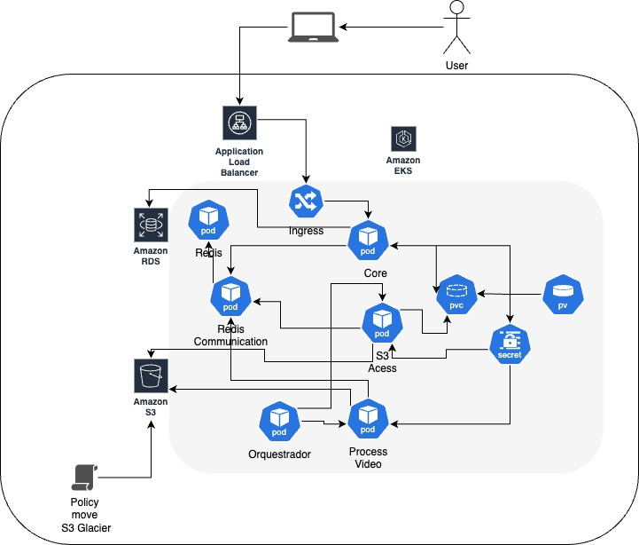
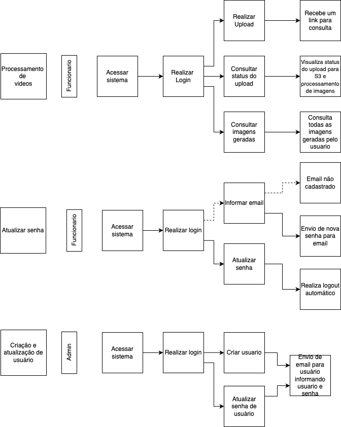

#Objetivo

Essa app tem como objetivo ser o core da app, a interface inicial do usuario, tanto para autenticação, comunicação com o banco.

*Necessário o serviço do Redis Communication estar de pé

# Aplicação Core

Essa aplicação serve como o núcleo da app, fornecendo a interface inicial do usuário para autenticação e comunicação com o banco de dados.

## Pré-requisitos

- Docker
- Kubernetes
- AWS CLI
- kubectl
- GitHub Actions

## Variáveis de Ambiente

As seguintes variáveis de ambiente são necessárias para a aplicação funcionar:

- `REDIS_MID_URL`: URL para o serviço de comunicação Redis.
- `POSTGRES_USER`: Nome de usuário do banco de dados PostgreSQL.
- `POSTGRES_PASSWORD`: Senha do banco de dados PostgreSQL.
- `POSTGRES_DB`: Nome do banco de dados PostgreSQL.
- `POSTGRES_SERVICE`: Nome do serviço ou endereço IP do banco de dados PostgreSQL.
- `POSTGRES_PORT`: Número da porta do banco de dados PostgreSQL.
- `SHARED_DISK`: Caminho para o diretório de disco compartilhado.

## Como Iniciar a Aplicação

### Iniciar o Banco de Dados

#### Usando Docker

```sh
docker run -d --name postgres -e POSTGRES_USER=postgres -e POSTGRES_PASSWORD=postgrespassword -e POSTGRES_DB=soat7hack -p 5432:5432 postgres:latest
```

## Iniciar o Banco

### Docker local
docker run -d --name postgres -e POSTGRES_USER=postgres -e POSTGRES_PASSWORD=postgrespassword -e POSTGRES_DB=soat7hack -p 5432:5432 postgres:latest

### Kubernetes
Acesse a raiz do projeto e entre na pasta .kube/db e execute os comandos abaixo:

kubectl apply -f postgres-pv.yaml --namespace=hackaton-soat7-2025
kubectl apply -f posgres-pvc.yaml --namespace=hackaton-soat7-2025
kubectl apply -f postgres-secret.yaml --namespace=hackaton-soat7-2025
kubectl apply -f postgres-deployment.yaml --namespace=hackaton-soat7-2025
kubectl apply -f postgres-service.yaml --namespace=hackaton-soat7-2025

### Para executar o RDS na AWS

https://github.com/Lehhh/fiap-hack-soat7-terraform-rds.git


##Para executar a app no Docker

docker run -d \
--name core-container \
-p 8080:8080 \
-e REDIS_HOST=redis-service \
-e REDIS_PORT=6379 \
-e POSTGRES_USER=postgres \
-e POSTGRES_PASSWORD=postgrespassword \
-e POSTGRES_DB=soat7hack \
-e POSTGRES_PORT=30081 \
-e POSTGRES_SERVICE=192.168.15.9 \
-e SHARED_DISK=/opt/app/shared \
-v /opt/app/shared:/opt/app/shared \
core:1.0.0

------
Arquitetura:



------
Fluxograma:


